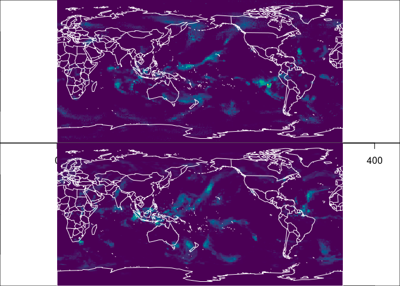

<!-- README.md is generated from README.Rmd. Please edit that file -->

# zarrr

<!-- badges: start -->
<!-- badges: end -->

The goal of zarrr is to … learn xarray and python and read Zarr in R.

WIP

## Example

This reads a slice from a zarr file via xarray, orients from
xarray/numpy to R and plots with an extent (using raster/GDAL data
orientation assumption).

Example and inspiration take from this really excellent aggregation
example by Ryan Abernathy. I’m using this to demonstrate a similar
approach in R, for me to learn python and explore ideas.

<https://discourse.pangeo.io/t/conservative-region-aggregation-with-xarray-geopandas-and-sparse/2715>

To open the Zarr source do

``` r
library(zarrr)
store <- "https://ncsa.osn.xsede.org/Pangeo/pangeo-forge/gpcp-feedstock/gpcp.zarr"
z <- xarray_zarr(store)
```

We can now use the xarray facilities.

``` r
## get coordinate bounds and a data slice
xc <- z$lon_bounds$values
yc <- z$lat_bounds$values

library(reticulate)  ## for dict()
shape <- z$precip$shape
#
precip0 <- z$precip$isel(dict(time = 0L))$values
precipn <- z$precip$isel(dict(time = as.integer(shape[[1]] - 1)))$values
library(ximage)
ex <- c(range(xc), range(yc))  ## these are regular grid
par(mfrow  = c(2, 1), mar = rep(0, 4))
cols <- hcl.colors(128)
zlim <- z$precip$valid_range
ximage(precip0, col = cols, zlim = zlim, asp = 1, extent = ex); maps::map('world2', add = TRUE, col = "white")
ximage(precipn, col = cols, zlim = zlim, asp = 1, extent = ex); maps::map('world2', add = TRUE, col = "white")
```



In zarrr we have a global ‘xarray’ object, that is equivalent to ‘xr’ in
`python import xarray as xr`. ‘xarray_zarr()’ in this package is just a
helper for the following python-equiv code.

``` r
library(zarrr)
store <- "https://ncsa.osn.xsede.org/Pangeo/pangeo-forge/gpcp-feedstock/gpcp.zarr"
zarrr:::xarray$open_dataset(store, engine = 'zarr', chunks = dict())
#> <xarray.Dataset>
#> Dimensions:      (latitude: 180, nv: 2, longitude: 360, time: 9226)
#> Coordinates:
#>     lat_bounds   (latitude, nv) float32 dask.array<chunksize=(180, 2), meta=np.ndarray>
#>   * latitude     (latitude) float32 -90.0 -89.0 -88.0 -87.0 ... 87.0 88.0 89.0
#>     lon_bounds   (longitude, nv) float32 dask.array<chunksize=(360, 2), meta=np.ndarray>
#>   * longitude    (longitude) float32 0.0 1.0 2.0 3.0 ... 356.0 357.0 358.0 359.0
#>   * time         (time) datetime64[ns] 1996-10-01 1996-10-02 ... 2021-12-31
#>     time_bounds  (time, nv) datetime64[ns] dask.array<chunksize=(200, 2), meta=np.ndarray>
#> Dimensions without coordinates: nv
#> Data variables:
#>     precip       (time, latitude, longitude) float32 dask.array<chunksize=(200, 180, 360), meta=np.ndarray>
#> Attributes: (12/45)
#>     Conventions:                CF-1.6, ACDD 1.3
#>     Metadata_Conventions:       CF-1.6, Unidata Dataset Discovery v1.0, NOAA ...
#>     acknowledgment:             This project was supported in part by a grant...
#>     cdm_data_type:              Grid
#>     cdr_program:                NOAA Climate Data Record Program for satellit...
#>     cdr_variable:               precipitation
#>     ...                         ...
#>     standard_name_vocabulary:   CF Standard Name Table (v41, 22 February 2017)
#>     summary:                    Global Precipitation Climatology Project (GPC...
#>     time_coverage_duration:     P1D
#>     time_coverage_end:          1996-10-01T23:59:59Z
#>     time_coverage_start:        1996-10-01T00:00:00Z
#>     title:                      Global Precipitation Climatatology Project (G...
```

------------------------------------------------------------------------

## Code of Conduct

Please note that the zarrr project is released with a [Contributor Code
of
Conduct](https://contributor-covenant.org/version/2/1/CODE_OF_CONDUCT.html).
By contributing to this project, you agree to abide by its terms.
