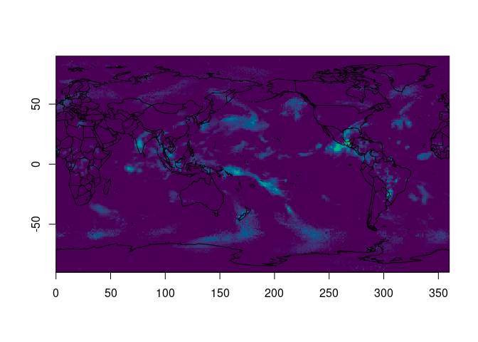

<!-- README.md is generated from README.Rmd. Please edit that file -->

# zarrr

<!-- badges: start -->
<!-- badges: end -->

The goal of zarrr is to … learn xarray and python and read Zarr in R.

WIP

## Example

This reads a slice from a zarr file via xarray, orients from
xarray/numpy to R and plots with an extent (using raster/GDAL data
orientation assumption).

All hardcoded for now, use `read_zarr()` to read a slice from the 3rd
dim - use `read_zarr_raw()` to get an entire array by name.

Example and inspiration take from this really excellent aggregation
example by Ryan Abernathy. I’m using this to demonstrate a similar
approach in R, for me to learn python and explore ideas.

<https://discourse.pangeo.io/t/conservative-region-aggregation-with-xarray-geopandas-and-sparse/2715>

``` r
source("read_zarr.R", echo = TRUE)
#> 
#> > src <- "https://ncsa.osn.xsede.org/Pangeo/pangeo-forge/gpcp-feedstock/gpcp.zarr"
#> 
#> > reticulate::source_python("read_zarr.py")
#> 
#> > x <- read_zarr(src, "precip", slice = 1)[1, , , drop = TRUE]
#> 
#> > xs <- read_zarr_raw(src, "lon_bounds")
#> 
#> > ys <- read_zarr_raw(src, "lat_bounds")
#> 
#> > ex <- c(range(xs), range(ys))
#> 
#> > ximage::ximage(x[nrow(x):1, ], extent = ex, col = hcl.colors(256))
```



    #> 
    #> > maps::map("world2", add = TRUE)
